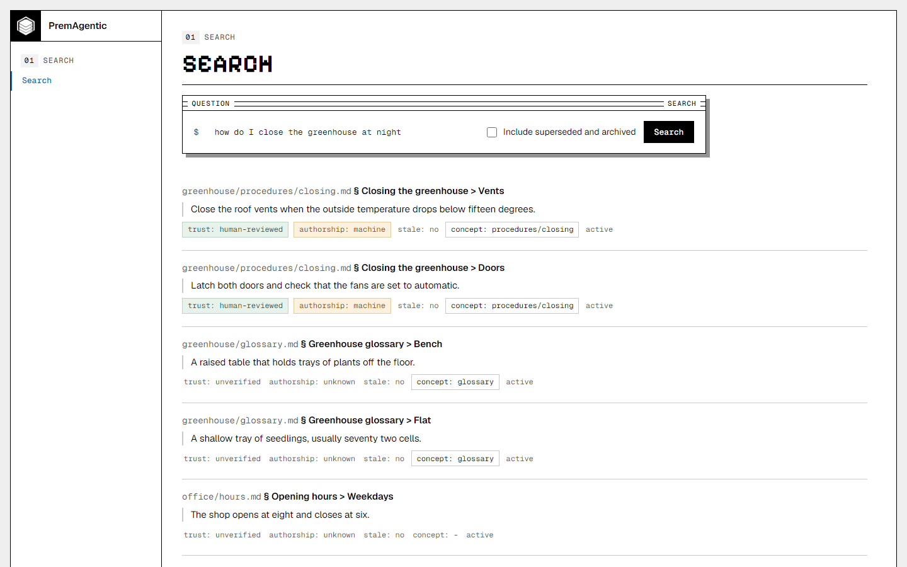
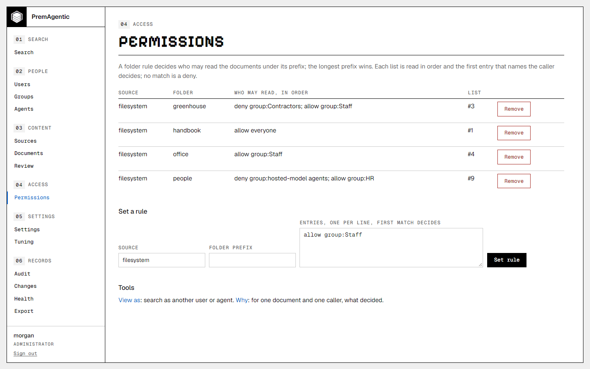
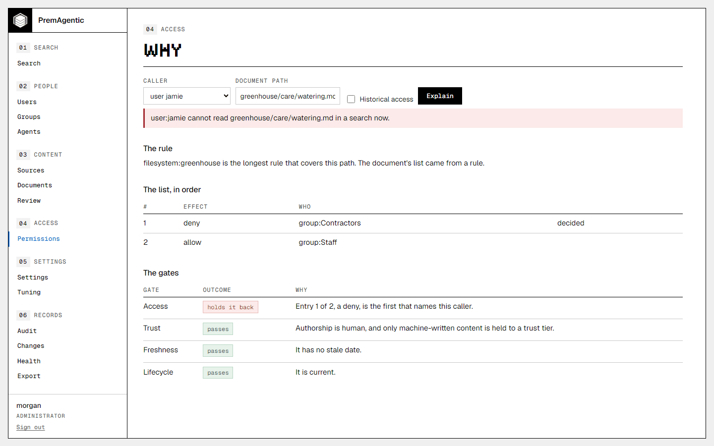
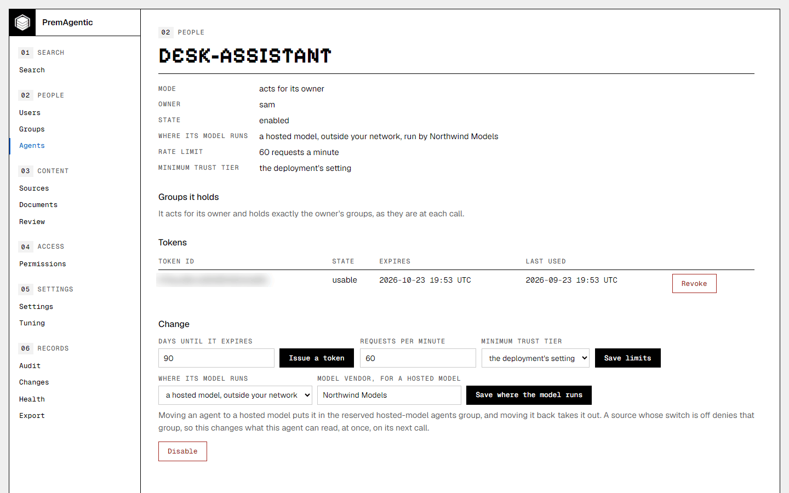
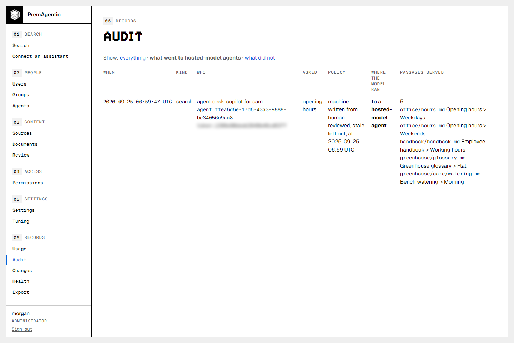

# PremAgentic

On-premises, for agents: the name says what it is. Governed knowledge
retrieval that runs entirely inside a customer's own network. Point it at a
folder of Markdown, text, PDF, Word or Excel files (the last three through
first-party extensions an administrator allows), write down who may read which folders,
and its people and agents get cited answers out of them, with those rules
enforced before anything is retrieved.



*PremAgentic decides what the model is allowed to know. Every answer is a cited passage, marked with its trust, authorship and freshness.*

```
the customer's folders of documents -> connector -> chunk -> embed (locally)
-> plain PostgreSQL -> access, lifecycle, trust and freshness gates
-> lexical search in PostgreSQL + exact vector search in process, fused
-> cited answers
-> a golden set that proves it works on THIS corpus
```

At runtime, with the default local embedding provider, PremAgentic makes no
outbound call, needs no third-party API key, and sends no document anywhere on
its own. An assistant that runs on a hosted model does receive the passages each
search returns: PremAgentic asks where each agent's model runs, writes the
answer on every audit row, and can keep a folder from every agent registered as
using one (see
[Connect an assistant](docs/connect-an-assistant.md)). PremAgentic calls out to
nothing else unless an administrator selects the optional `openai` embedding
provider or installs and allows an extension that does; a reminder sink that
sends mail is a sample, not a built-in. With an HTTPS certificate issued by a
certificate authority, the runtime's TLS stack may also fetch the certificate's
revocation status (OCSP) and missing intermediate certificates, more than once;
the self-signed certificate setup makes by default names no such address.

How that claim is tested, and what installing needs from the internet once, is on
[What PremAgentic is](docs/what-it-is.md).

## What it reads

Markdown and plain text files are read by built-in readers. PDF, Word (`.docx`)
and Excel (`.xlsx` and `.xlsb`) files are read by three first-party extensions
in this repository, [`extensions/pdf-reader`](extensions/pdf-reader/README.md),
[`extensions/docx-reader`](extensions/docx-reader/README.md) and
[`extensions/xlsx-reader`](extensions/xlsx-reader/README.md). They are built
with the solution and, like any extension, load only once an administrator puts
each one's build output in the extensions folder and allows it with
`prem extensions allow`. All three read text and nothing else: no link, script,
macro or embedded file in a document is followed or run, and a file that
crosses a limit is reported with the limit it crossed, never read in part. A
PDF passage is cited by its page, a Word passage by the document's own
headings, and an Excel passage by its sheet. A file a reader recognizes and
will not index is counted with its reason, such as `.pdf (no text layer)`,
`.doc (legacy .doc)` or `.docm (macro-enabled)`, and a file no reader claims is
counted by its extension, so a folder of them does not look like an empty run.
Before any reader sees a file, the run reads no more than 256 MB of it, and one
file the index cannot store never stops a run.

`tests/Premagentic.Benchmark` times the search path on a synthetic index, and
anyone can rerun it on a throwaway database; every table it prints names
the machine it ran on and which of its two modes it ran in
([Measuring it yourself](docs/benchmark.md)).

## What it does not do

- It does not write to the source.
- It does not generate prose.
- It does not recognize text in pictures or scanned pages.

The first two are explained under
[What it does not do](docs/what-it-is.md#what-it-does-not-do); what it reads
is above. Sign-in through a company directory is next in the
[PremAgentic business add-on](#license).

## Quick start

```powershell
# 1. Local stock PostgreSQL 17, on 5434 to stay clear of any PostgreSQL already on 5432 or 5433
docker compose up -d

# 2. Use the local development database for this shell. PremAgentic connects to
#    nothing unless told where; this switch names the compose instance.
$env:PREM_DEV_DATABASE = "1"    # Linux or macOS: export PREM_DEV_DATABASE=1

# 3. One time: fetch the local embedding model (all-MiniLM-L6-v2 ONNX, ~90 MB)
./scripts/download-model.ps1          # Windows; on Linux or macOS: ./scripts/download-model.sh

# 4. Create the two groups the sample corpus and golden set name
dotnet run --project src/Premagentic.Cli -- groups add hr
dotnet run --project src/Premagentic.Cli -- groups add engineering

# 5. Ingest the sample corpus. Each folder gets its own rule, so the two go in
#    separately with different audiences.
dotnet run --project src/Premagentic.Cli -- ingest ./sample-docs/open --public --prefix open
dotnet run --project src/Premagentic.Cli -- ingest ./sample-docs/hr --principals group:hr --prefix hr

# 6. Ask it something
dotnet run --project src/Premagentic.Cli -- search "how long do I have to file an expense claim" --as group:engineering

# 7. Prove the gate. HR reaches the salary bands; engineering does not.
dotnet run --project src/Premagentic.Cli -- search "band four compensation review" --as group:hr
dotnet run --project src/Premagentic.Cli -- search "band four compensation review" --as group:engineering

# 8. Run the golden set, which asserts both of those outcomes. It is the starter
#    profile's own file, so the questions are the ones the profile applies.
dotnet run --project src/Premagentic.Cli -- eval samples/profiles/starter/golden-set.json eval/report.md

# Tests (unit plus a Testcontainers end-to-end slice; Docker required)
dotnet test
```

The same setup is a profile. On a fresh database, `prem profile apply
./samples/profiles/starter` creates the two groups, registers the two
sources with their rules and sets the golden set in one step; applying it
again changes nothing and says so. See [Profiles](docs/profiles.md).

The command line explains itself, with no database configured:

```
prem --help                  every command, with every option explained
prem <command> --help        one command's part
prem --version               the version, with the commit it was built from
prem reminders run [--plan]  what each source owner is reminded of: stale documents and the review queue
```

The full list is on [The prem command](docs/cli.md), which is generated from the program.

## Connect an assistant

Agents connect over MCP at `/mcp` in the same process, with their token.
They get two read-only tools, `search_knowledge` and `get_document_section`, and no tool that writes, stores or remembers anything.
For an agent that only speaks stdio, `Premagentic.McpServer` is a bridge. How to connect one: [Connect an assistant](docs/connect-an-assistant.md).

A person can connect their own assistant at `/portal/connect`: the agent it
makes acts as that person and nothing more, its token is shown once beside
the configuration for the assistant they use, and they can revoke it there.
An administrator bounds how many each person may have with
`agents.self_service_max` (0 turns it off) and can reword any configuration
with `connect.snippets`. An administrator can give every assistant the
deployment's own instructions with `prem settings set mcp.instructions
"<text>"`: a client that reads what a server sends at connect receives them,
they are served as the resource `premagentic://instructions`, and the
connect page shows them for pasting into `AGENTS.md`, `CLAUDE.md` or a
client's own instructions.

## See it



*Folder rules decide who may read what. The first entry that names the caller decides, and no match is a deny.*



*Ask why for any person and any document, and PremAgentic shows the rule and every gate. Here a contractor is held back from the greenhouse notes.*



*Every agent carries where its model runs. Move one to a hosted model and the folders kept from hosted-model agents close to it on its next call.*



*The audit shows who asked, under which policy, where the model ran and every passage served, filtered here to what went to hosted-model agents.*

## Documentation

- **Start:** [What PremAgentic is](docs/what-it-is.md), [Getting started](docs/getting-started.md), [Connect an assistant](docs/connect-an-assistant.md)
- **How it decides:** [Access](docs/access.md), [Lifecycle, trust and freshness](docs/lifecycle-trust-freshness.md), [Administration](docs/administration.md)
- **Operate:** [Installing](docs/installing.md), [Running it](docs/running.md), [Upgrading and removing](docs/upgrading-and-removing.md), [Configuration](docs/configuration.md), [Storage](docs/storage.md), [The fully local stack](deploy/fully-local/README.md)
- **Extend:** [Sources, readers and chunkers](docs/sources-readers-chunkers.md), [Extensions](docs/extensions.md), [Writing an extension](docs/writing-an-extension.md), [Connectors](docs/connectors.md), [Profiles](docs/profiles.md), [Tuning and the golden set](docs/tuning-and-the-golden-set.md)
- **Reference:** [Surfaces](docs/surfaces.md), [The prem command](docs/cli.md), [Known state](docs/status.md), [Roadmap](docs/roadmap.md)

The index of all of them, with what each covers, is [docs/README.md](docs/README.md).

## Get involved

To contribute see [`CONTRIBUTING.md`](CONTRIBUTING.md); your first pull
request asks you to sign the contributor license agreement, once. Questions
and ideas go to the repository's Discussions, a first change starts with an
issue labeled good first issue, and what comes next is on
[Roadmap](docs/roadmap.md).

## Support

Support comes with the PremAgentic business add-on, from Agave Information
Solutions, LLC: help installing and upgrading, sizing the hardware, mapping
an organization's directory and permissions into PremAgentic, and answers
from the maintainers. Write to premagentic@agaveis.com.

Questions go to the repository's Discussions and bugs to its issues, where
the maintainers read and triage them. Security reports are always answered;
see [`SECURITY.md`](SECURITY.md).

## License

PremAgentic is free software under the GNU Affero General Public License,
version 3 only (`AGPL-3.0-only`). See `LICENSE` and `NOTICE`. Dependency and
model licenses are listed in `THIRD-PARTY-NOTICES.md`.

Agave Information Solutions, LLC also offers PremAgentic under a commercial
license, for building it into a closed product, or running a changed copy for
its users without offering them its source. Write to premagentic@agaveis.com.

**The PremAgentic business add-on** is what an organization adds to run
PremAgentic for many people. It carries directory group mapping, and audit
retention and export. Next in it: sign-in through Microsoft, Google or another
OIDC provider, with group sync; connectors that read a source's own
permissions, for SharePoint, OneDrive and Windows file shares; the
administration API; and a signed installer. Support comes with it.

The add-on installs as one extension on the same extension host, allowed by
hash like any other, and it is free for a deployment of up to 10 users. Its
license is a signed file checked on the machine: there is no license server,
and the check calls out to nothing. Customers can read the add-on's source to
see how it reads permissions.

The PremAgentic name belongs to Agave Information Solutions, LLC and is not
licensed with the code.

To report a vulnerability see `SECURITY.md`; to contribute see
`CONTRIBUTING.md`.
