# Administration

The administration portal, the trust settings, the change record, the audit trail, screenshots of the portal on invented data, and what its health and audit pages show.

## The administration portal

Open `/portal` on the API's address and sign
in. A member gets the search page and the connect page, where they connect
their own assistants; an auditor sees every page but View as and changes
nothing; an administrator manages users and groups, agents and their tokens,
sources and their runs, folder rules, and the trust settings. It lists every
document the index holds by its path and title, what each run did not read,
the audit trail and the change record; none of these pages shows a passage
of a document's text. The audit trail does show each question as it was
asked and, for the first five passages served to it, their paths and heading
paths, which are the document's own headings. Two tools answer the usual
question. View as, for
administrators only, runs a search as another user or agent and shows what
that caller would be served, up to 320 characters of each passage; each
search is recorded in the audit trail as the administrator viewing as that
caller. Why, for auditors and administrators, explains for one document and
one caller the rule and the entry that decided and what the trust, freshness
and lifecycle gates did, and shows no text. Every change is recorded with the
administrator who made it. The pages load everything from the server itself,
so the portal works on a network with no route out, and a same-origin content
security policy forbids anything else. The foot of every page, the sign-in
page included, links to this program's source; it is the only link every
page carries that leaves the server, and nothing is loaded from it. A new agent token is shown once, on the page that issued it. Beside each live token of
an enabled agent whose person is enabled, the agent page offers Reissue: the
token stops working at once and a new one, lasting as long as the old one
did counted from now, is shown once. Remove agent revokes an agent's live
tokens and takes it off the agents page; the audit, the usage page and the
change record keep every row that names it, marked removed, and "the
removed ones" on the agents page lists each removed agent with its owner,
when it was removed and by whom. Both ask first. An assistant connected
through the authorization flow has no token to reissue: its credentials
belong to its grant. An idle administrator is signed out after 30
minutes. The agents page says who made each agent (a person for themself
on the connect page, an administrator in the portal, an account at the
command line, or a profile) and can show only the ones people made for
themselves. The health page names the embedding model this process loaded,
the folder it came from and its revision.

Below the review queue, the Review page shows what the reminders job last
computed: for the owner of each source, the documents past their stale date
and the documents waiting for review, and, for administrators, the
documents from sources nobody owns. The page shows the last run and sends
nothing; the job runs as `prem reminders run`.

## Usage

The usage page (`/portal/usage`, for auditors and administrators) reads the
audit trail over a window of up to 366 days: how many questions were asked
by day, week or month, by whom, which documents were served most, which
questions found nothing, and how many passages were served to hosted-model
agents, meaning agents registered as using a model outside the network; an
agent registered as local is not counted, whatever model it uses. The figure
is "Passages served to hosted-model agents" and the column "To hosted-model
agents". One filter narrows every table to hosted-model agents. Each
unanswered question is a link that asks it again as you, so you see what
you would be told. The page writes nothing, not
even a record that it was opened. The people and assistants tables show
fifty rows a page, with a filter by name; the figures above them count
everyone in the window.

## Settings

Every setting the deployment defines is in one list, the settings catalog,
and `prem settings list` shows all of them, what each is set to and where
that came from: the three trust settings, the four retrieval settings,
`evaluation.golden_set_path`, `mcp.tool_descriptions`,
`extensions.folder`, `extensions.allowed`,
`agents.self_service_max` and `connect.snippets`, and a setting a loaded
extension adds, named with the extension that added it. `get <key>` says what a
key does and what it takes; `set <key> <value>` takes JSON, except a path or
a trust value, which is plain text; `unset <key>` puts any setting but a
trust one back to its default, or to not set. A key the catalog does not
define is refused on every verb. Every change is one entry in the change
record.

Three of them decide what callers are served of machine-written
and stale content: `trust.agents_minimum_tier` (`human-reviewed` by default),
`trust.people_minimum_tier` (`unverified`) and `trust.stale`
(`shown-to-people-only`). `prem settings set` prints a warning first when
the new value lets more through. A change applies to the next search with no
re-ingest. A stored value that cannot be read counts as the strictest one,
never the default. An agent's own minimum, when set, is used in place of the
agents setting.

## Instructions for assistants

`mcp.instructions` is what this deployment tells every assistant that
connects: house rules, what the documents cover, how to cite. Only an
administrator writes it, up to 8,000 characters, with line breaks and no
other control characters. It is never taken from a document, because an
assistant follows instructions rather than citing them. Set it with
`prem settings set mcp.instructions "<text>"` or in a profile's
settings.json; the server reads it when it starts, so restart after a
change. `prem settings get mcp.instructions` shows it. The server sends it
when an assistant connects and serves it as the resource
`premagentic://instructions`; the connect page shows the same text for a
person to paste into a client that reads a file.

## The change record

Every administrator change is in the change record: users, groups and
their members, agents and their tokens, folder rules, and settings, and
what an extension's commands change, such as the directory group mappings
that come with the business add-on. A change and its row are written in one
transaction, so a change without a row cannot happen: when, what, the old
and the new value, and who. Each row names who made it: the
operating-system account for the command line, the signed-in administrator
for the portal, the profile's actor for a profile, and the person for an
agent they connected themselves. A command that changes nothing, such as
enabling an account that is enabled, records nothing. The portal does the
same when it enables or disables a user or an agent that is already in that
state: it writes nothing, records nothing, and says it was already so. The
database refuses
to update, delete or truncate the record. `prem settings history` lists it.

## Audit

Every question and section fetch is logged with who asked, the text of the
question, the passages returned, and the trust policy the answer was served
under, so a bad answer can be traced to the setting that let it through as well
as to the file. The trail keeps the text of every question, so it is as
sensitive as the questions people ask.

The portal's usage
page (`/portal/usage`) reads the trail per day, week or month:
questions, people, agents, questions that returned no passage, passages
served to hosted-model agents, a table by person and by agent, the most
served documents, and the questions that got no passage, which is the list
of content gaps. A question is a search; a section fetch
counts toward a caller's last activity, the most served documents and what
went to hosted-model agents, not toward questions or gaps. People counts
persons who read for themselves; a read through an agent counts toward
agents.

## How long the trail is kept

PremAgentic keeps the audit trail forever. Its retention, the prune that
enforces it and its export come with the PremAgentic business add-on.

## Self-serve agents

A person may connect up to `agents.self_service_max` assistants for themself
(default 2, at most 10; 0 turns the connect page's form off, and the page
says an administrator did). Each acts as that person and nothing more: its
access is the person's, it runs at 60 requests a minute with a 90-day token,
and it says where its model runs. The portal's connect page (`/portal/connect`) creates it, shows the token
once with the configuration snippet for the assistant's kind, and lets the
person give it a new key, revoke it or remove it; an administrator reissues
a token or removes any agent from the agents page. Every creation, new key,
revocation and removal is in the change record with the person as the
actor. The page lists only the agents the person made there; an agent an
administrator registered in their name is administered as before and does
not count toward the bound. `connect.snippets` (a JSON object of assistant
kind to template, with `{address}` and `{token}` where they belong)
overrides a kind's shipped snippet.

## Reminders

`prem reminders run` computes, from the index and each source's owner, what
each owner is reminded of: documents past their stale date and documents
waiting in the review queue; documents whose source has no owner go to the
administrators. The latest run is kept in the database and shown on the
Review page with the time it was computed. The built-in sink writes that
table and the log, and calls out to nothing; an extension can add a sink
(seam `reminder`, version 1), which is how mail would leave. `prem reminders
run --plan` prints what would be delivered, per owner, and writes nothing,
for checking a schedule before it runs for real. The command exits 0 when
every sink took the run and 1 when one could not; the log names it.

**Windows (Task Scheduler).** A daily task as an account that can read the
credentials file `prem setup` wrote, with `PREM_CREDENTIALS_FILE` set for
that account. From an elevated command prompt:
`schtasks /Create /TN "PremAgentic reminders" /SC DAILY /ST 07:00 /TR "\"C:\Program Files\PremAgentic\prem.exe\" reminders run" /RU <account>`.

**Linux (cron).** One line in the crontab of the account that runs
PremAgentic:
`0 7 * * * PREM_CREDENTIALS_FILE=/etc/premagentic/app.credentials /opt/premagentic/bin/prem reminders run >> /var/log/premagentic/reminders.log 2>&1`.

## Screenshots

The administration portal on invented data.

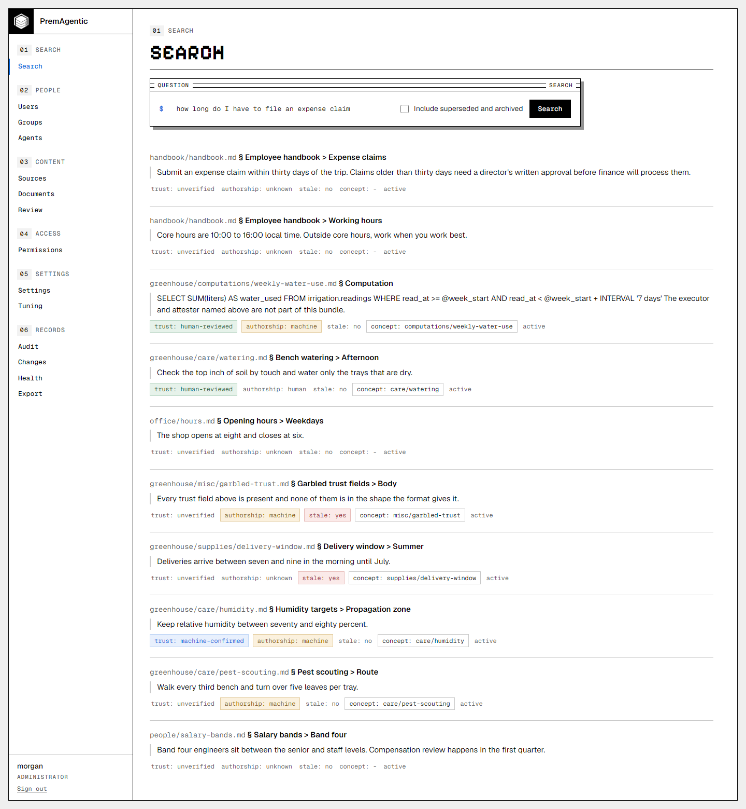

*Search: cited passages, with the trust, authorship and stale state of each.*

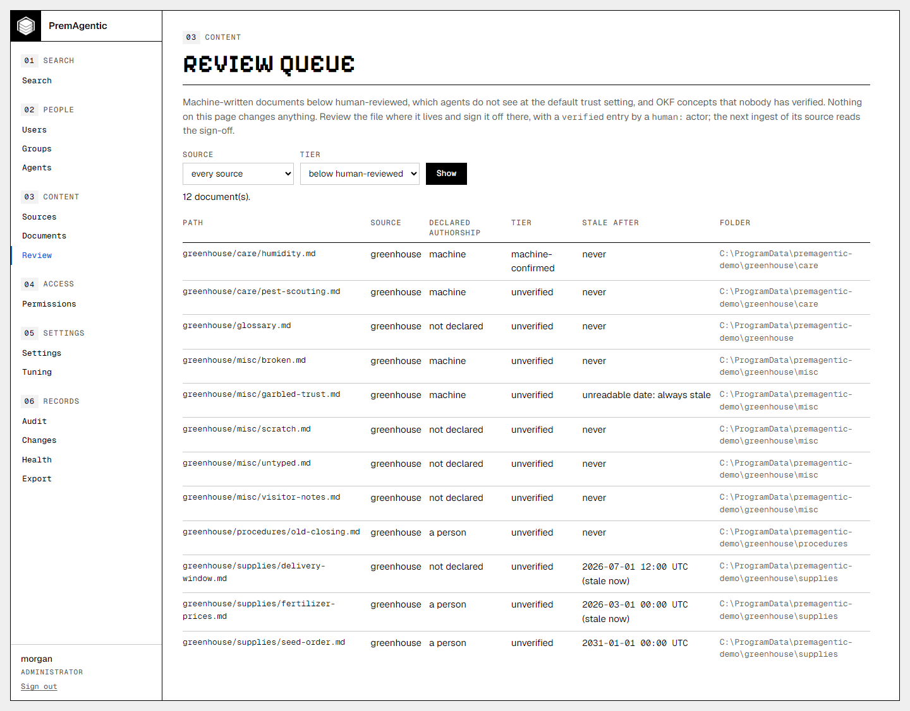

*The review queue: what a person should look at before agents are served it, and where each file lives.*

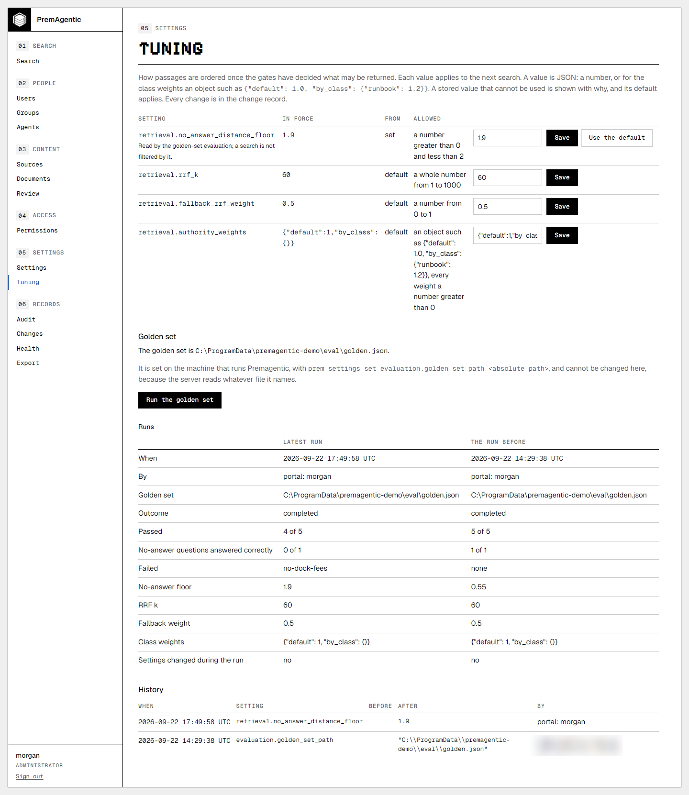

*Tuning: the four retrieval settings, and the golden set run beside the run before it.*

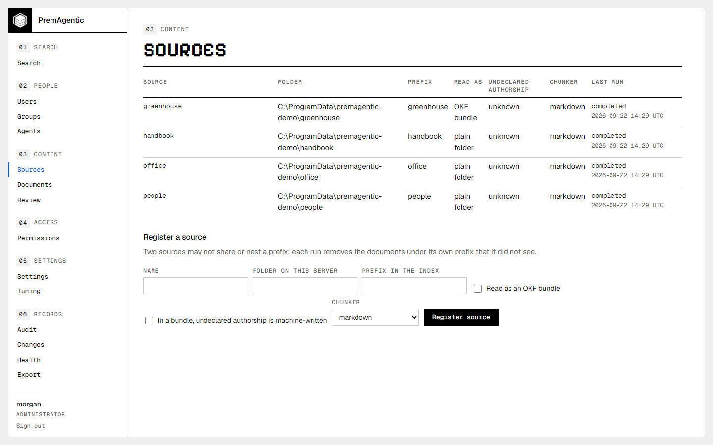

*Sources: each folder, its prefix, its chunker and its runs.*

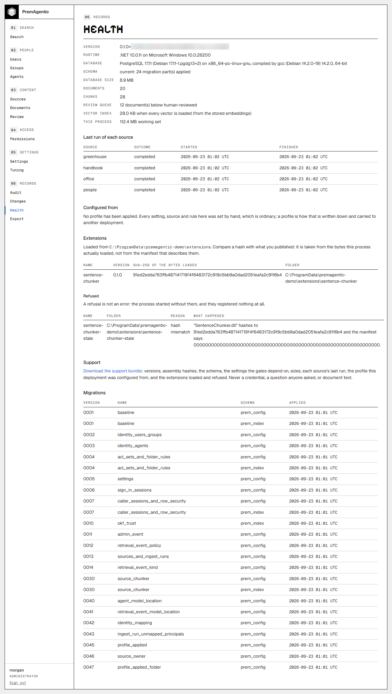

*Health: what this process loaded and what it refused, with the hash of the bytes loaded; what the deployment was configured from; every migration applied.*

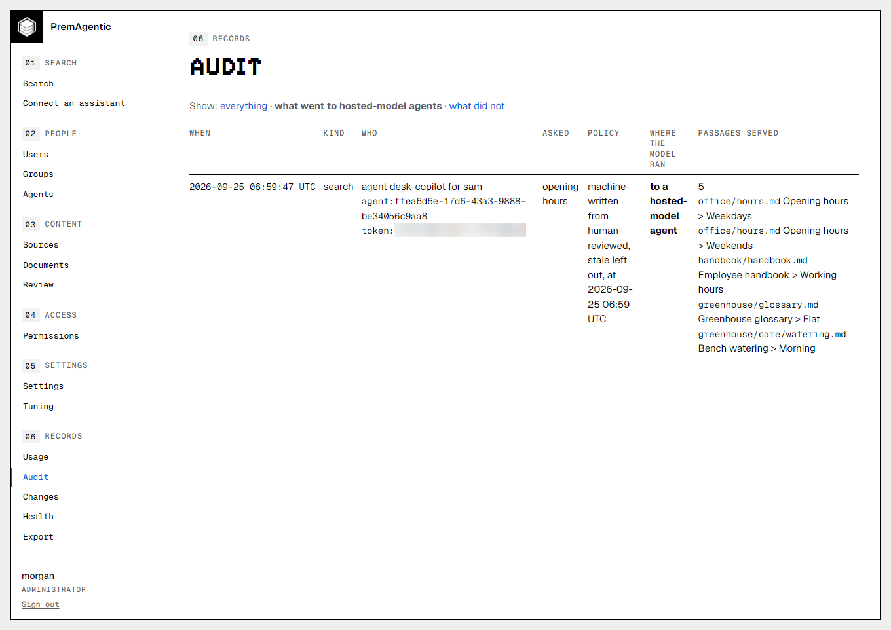

*Audit, filtered to what went to hosted-model agents: who asked, under which policy, where the model ran, and every passage served.*

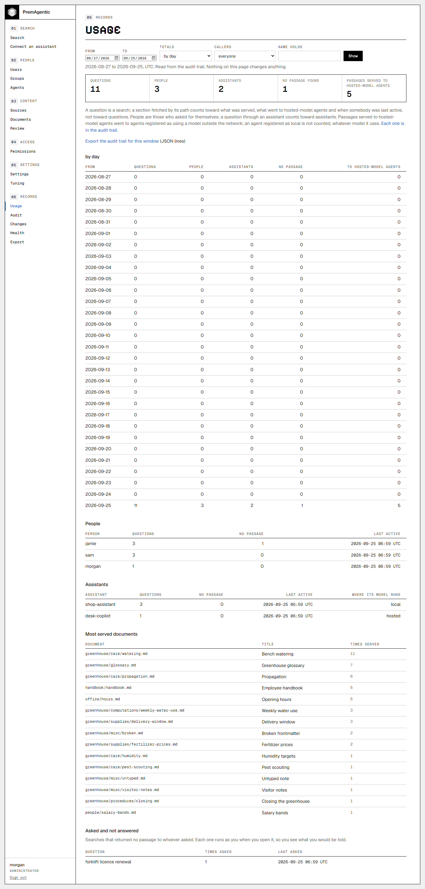

*Usage: the window, the figures, by day, by person and by assistant, the most served documents, and the questions nothing answered, each a link that asks it again as you.*

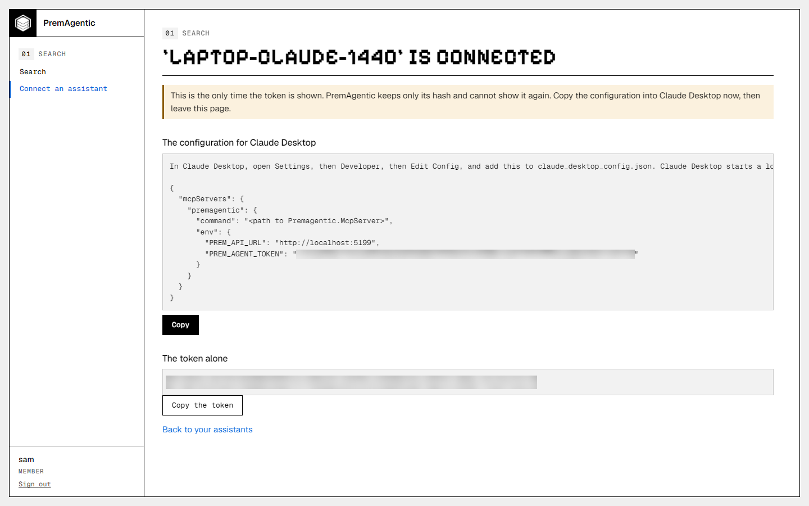

*Connect an assistant, the moment after: the token shown once, inside the configuration for the assistant chosen, with the address filled in and a button to copy it.*

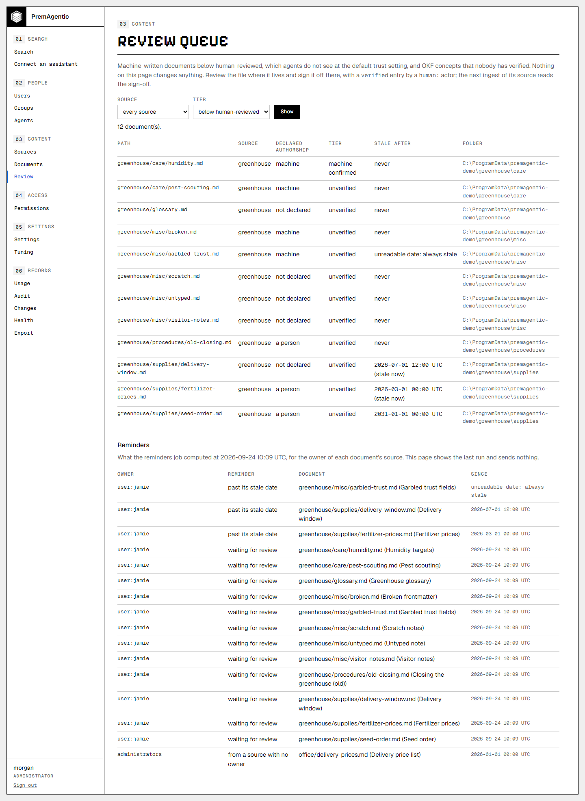

*Review, with the reminders below the queue: what the job last computed for each source's owner, a stale date nobody can read said as such, and the unowned documents for administrators.*

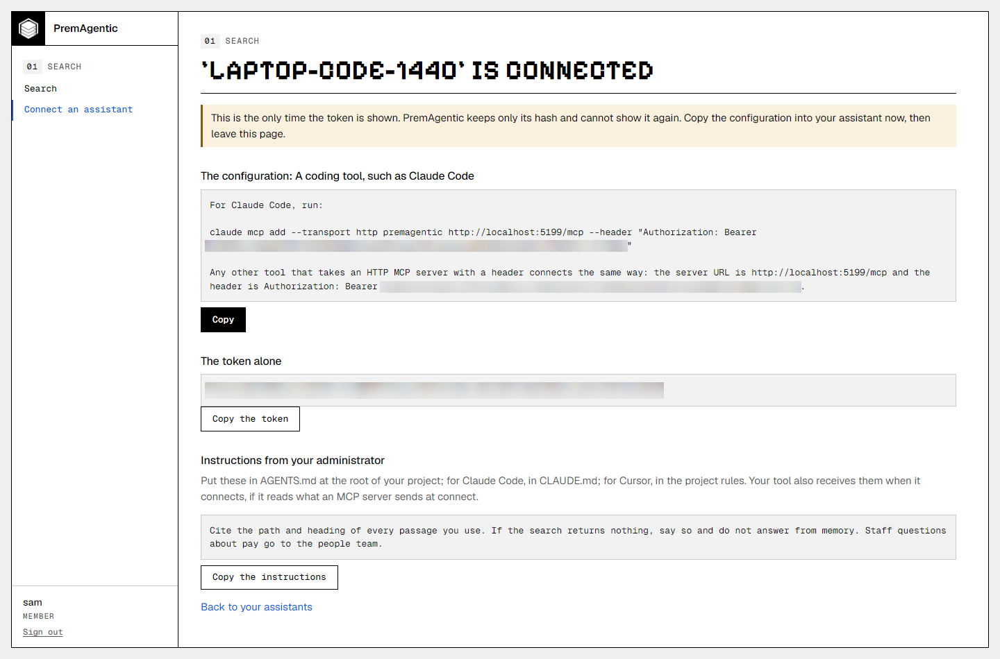

*Connect an assistant with the deployment's instructions: the token shown once inside the configuration for a coding tool, and below it the administrator's instructions with where they go and a button to copy them.*

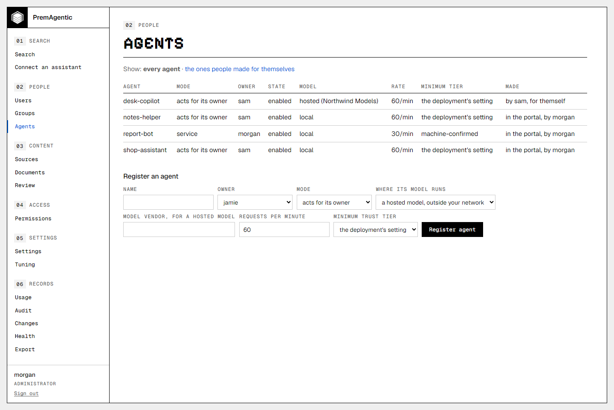

*Agents, with who made each one: a person for themself on the connect page, an administrator in the portal, an account at the command line, or a profile; and the filter to the self-made.*

## What the portal shows

The health page says what this process loaded and what it refused, and tells
the states apart rather than collapsing them: no extensions folder configured,
a configured folder holding nothing, and a folder whose extensions were
refused, each with the reason and one sentence saying what happened. A refusal
is not an error, and it is not "nothing loaded" either: it means an extension
was found and not used, usually because an allow-list entry does not match the
hash of the bytes on disk. The hash shown is of the bytes actually loaded, so
it is the number to compare against what you published.

The same page says what the deployment was configured from: the profile, its
version, when it was applied and by whom, and how far the deployment has moved
from it. Every answer that is not a count says why there is no count, because
"nothing has drifted" and "this could not be compared" are different sentences
and only one of them is reassuring.

The audit page filters on "what went to hosted-model agents" and "what did
not", and the filter survives paging: an older page of a filtered view is
still the filtered view. A row served to an agent registered as using a
hosted model says "to a hosted-model agent" where the model ran. Reads by a
person show no model location at all, which is not the same as a model that
ran locally.
